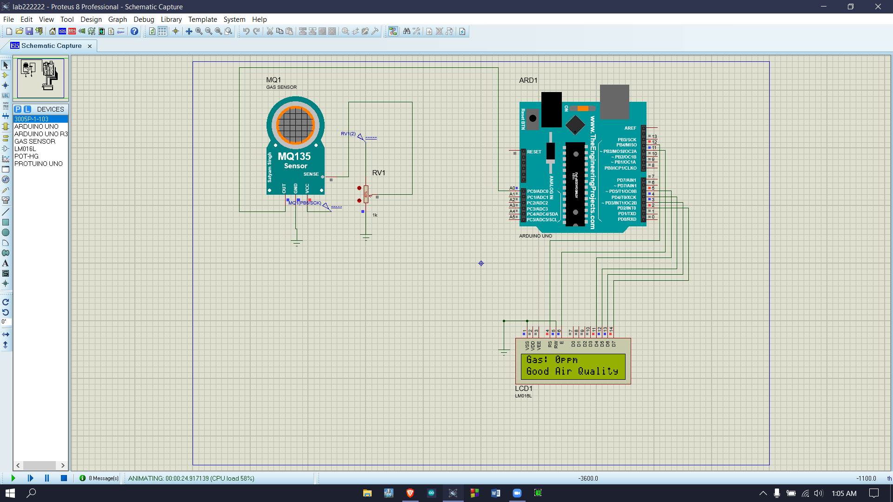

# Air Quality Monitor (Arduino + MQ-135)

A low-cost indoor air quality monitor built on an Arduino Uno. An MQ-135 gas sensor measures the concentration of pollutant gases (CO2, ammonia, NOx, alcohol vapour, smoke, benzene), the reading is shown live on a 16x2 LCD and the air is classified as **Good** or **Bad** against a threshold. The circuit was designed and simulated in Proteus and then built on a breadboard.

Built as a 5th-semester electronics lab project at International Islamic University Chittagong (IIUC), 2021.



## Features

- Live gas level on a 16x2 character LCD, refreshed every 400 ms without flicker
- Good / Bad air quality status with hysteresis, so it does not toggle when the reading hovers at the threshold
- Averaging over 10 ADC samples per update to smooth sensor noise
- Serial output in `label:value` format, ready for the Arduino **Serial Plotter** or logging
- Optional heater warm-up period for real hardware
- Full Proteus simulation setup (component libraries included)

## Hardware

| Component                    | Qty | Notes                       |
| ---------------------------- | --- | --------------------------- |
| Arduino Uno (ATmega328P)     | 1   |                             |
| MQ-135 gas sensor module     | 1   | analog output used          |
| 16x2 character LCD (HD44780) | 1   | 4-bit parallel mode         |
| 10 kΩ potentiometer          | 1   | LCD contrast                |
| 220 Ω resistor               | 1   | LCD backlight current limit |
| Breadboard, jumper wires     | –   |                             |

### Wiring

| From                | To                  |
| ------------------- | ------------------- |
| MQ-135 VCC / GND    | 5V / GND            |
| MQ-135 AOUT         | A0                  |
| LCD VSS, RW, K      | GND                 |
| LCD VDD             | 5V                  |
| LCD V0              | potentiometer wiper |
| LCD RS, E           | D12, D11            |
| LCD D4, D5, D6, D7  | D5, D4, D3, D2      |
| LCD A (backlight +) | 5V through 220 Ω    |

A breadboard view is in [`docs/images/breadboard-fritzing.png`](docs/images/breadboard-fritzing.png).

## How it works

1. The MQ-135 contains a tin dioxide (SnO2) sensing layer whose resistance drops as the concentration of reducing gases rises. The module turns this into a voltage between 0 and 5 V on its analog output.
2. The Arduino's 10-bit ADC converts that voltage on A0 into a number from 0 to 1023. The sketch averages 10 samples to get one reading.
3. The reading is printed on the first LCD line and sent over serial.
4. If the reading goes above `THRESHOLD` (250) the second line shows **Bad Air Quality**; it switches back to **Good Air Quality** once the reading drops below `THRESHOLD - HYSTERESIS`.

### About the units

The number on the display is the raw ADC value, not a calibrated ppm figure. The original lab report labelled it "ppm", but the MQ-135 response is non-linear (it follows a power law of the sensor resistance ratio Rs/R0) and depends on temperature, humidity and the load resistor on the module. Converting to real ppm needs a calibration step: measure R0 in clean air, then apply the gas-specific curve from the MQ-135 datasheet. The raw value still works well as a relative indicator, which is how the threshold is used here.

## Getting started

### Run on real hardware

1. Install the [Arduino IDE](https://www.arduino.cc/en/software). `LiquidCrystal` ships with it.
2. Wire the circuit as in the table above.
3. Open [`air_quality_monitor/air_quality_monitor.ino`](air_quality_monitor/air_quality_monitor.ino), select **Arduino Uno** and upload.
4. Set `WARMUP_MS` to around `60000` for real hardware. A new MQ-135 needs a long burn-in (24 h or more) and each power-on needs a few minutes of heating before readings settle.
5. Open **Tools → Serial Plotter** (9600 baud) to see the reading and threshold as a live graph.

### Run the Proteus simulation

1. Extract the libraries in [`proteus-libraries/`](proteus-libraries) (Arduino Uno, Protuino and the TEP gas sensor) and copy the `.IDX` and `.LIB` files into Proteus' `LIBRARY` folder, then restart Proteus. [This video](https://www.youtube.com/watch?v=TKxAkE3837A) walks through the process.
2. Recreate the schematic from [`docs/images/proteus-simulation.png`](docs/images/proteus-simulation.png): Arduino Uno, MQ-135, LM016L LCD and a potentiometer (RV1) connected to the sensor's test pin.
3. In the gas sensor's properties, set _Program File_ to `GasSensorTEP.HEX` from the gas sensor library.
4. In the Arduino IDE use **Sketch → Export Compiled Binary**, then set the Arduino's _Program File_ in Proteus to the generated `.hex`.
5. Start the simulation and turn RV1 to change the simulated gas concentration.

## Results

Readings taken with the breadboard prototype in a room (from the lab report):

| Condition                          | Reading range |
| ---------------------------------- | ------------- |
| Outdoor fresh air                  | 120 – 230     |
| Normal indoor air                  | 230 – 250     |
| Exhaled breath (CO2)               | 260 – 350     |
| Smoke from a burning match         | 400 – 590     |
| Alcohol vapour from an open bottle | 550 – 800     |

Everything above the 250 threshold was correctly flagged as bad air. The full write-up with charts is in [`docs/lab-report.pdf`](docs/lab-report.pdf).

## Repository structure

```
air_quality_monitor/
  air_quality_monitor.ino   Arduino sketch
docs/
  lab-report.pdf            IEEE-style project report
  lab-proposal.pdf          Initial project proposals
  presentation.pptx         Final presentation
  images/                   Proteus schematic and breadboard diagram
proteus-libraries/          Arduino Uno, Protuino and MQ gas sensor models for Proteus
```

## Possible improvements

- Calibrate R0 and convert readings to an estimated CO2 ppm
- Add a DHT11/DHT22 to compensate for temperature and humidity
- Add a buzzer or LED for an audible/visual alarm
- Push readings to the cloud with an ESP8266 for remote monitoring

## Team

- Mushfiqus Salehin Afnan
- Mahir Shadid
- Md. Abul Bashar
- Tasin Tausif Mobin

Supervised by Mohammed Mahmudul Hasan Tareq, Department of CSE, IIUC.

## References

- [MQ-135 gas sensor overview (components101)](https://components101.com/sensors/mq135-gas-sensor-for-air-quality)
- [Arduino LiquidCrystal library](https://docs.arduino.cc/libraries/liquidcrystal/)
- [Reference build video](https://youtu.be/xgQyN54E3ms)
